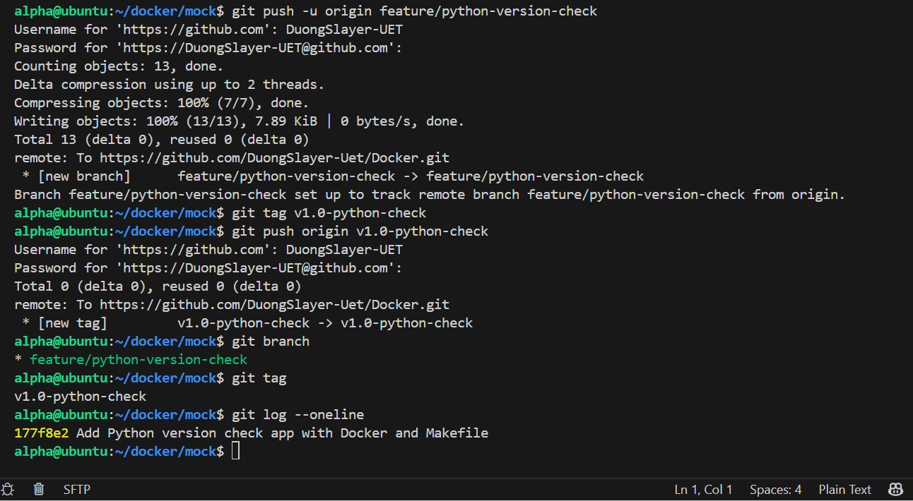
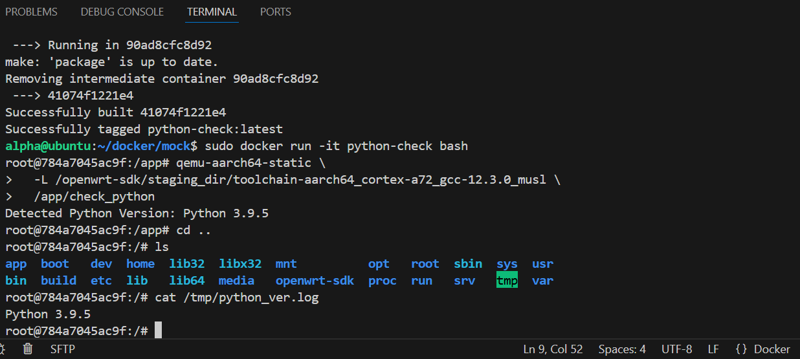
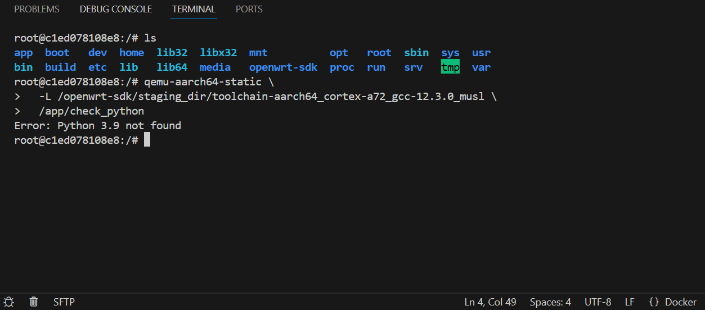

# Python Version Checker

## Link github
https://github.com/DuongSlayer-Uet/Docker/tree/feature/python-version-check

## Giới thiệu

Dự án mô phỏng quy trình phát triển một tiện ích userspace cho hệ thống Linux nhúng, cụ thể là theo hướng làm việc với OpenWRT trên Raspberry Pi 4B. Code viết bằng C, build trong Docker sử dụng **OpenWRT SDK** với toolchain cross-compile cho kiến trúc ARM64, dùng **QEMU** để chạy mô phỏng binary trên máy host x86_64, dùng Git để quản lý version và Makefile để tự động hóa các bước build/run/clean/package.

Mục tiêu chính là làm quen với quy trình phát triển trong môi trường cô lập, sử dụng OpenWRT SDK/toolchain để cross-compile ứng dụng, mô phỏng thực thi binary ARM64 bằng QEMU, và đóng gói ứng dụng dạng `.ipk`.

## Mô tả bài toán

`check_python.c` kiểm tra xem `python3.9` có được cài đặt trên hệ thống không.

- Nếu có: chạy `python3.9 --version`, in phiên bản ra terminal và ghi vào `/tmp/python_ver.log`
- Nếu không có: in `Error: Python 3.9 not found` và thoát với exit code khác 0

Dự án không cần deploy thực tế lên phần cứng, nhưng mô phỏng đúng flow phát triển ứng dụng userspace cho embedded Linux.

## Chức năng chính

1. Kiểm tra sự tồn tại của `python3.9` qua `which python3.9` hoặc kiểm tra return code của lệnh hệ thống
2. Nếu tìm thấy: chạy `python3.9 --version`, in kết quả dạng `Detected Python Version: 3.9.x`, ghi vào `/tmp/python_ver.log`
3. Nếu không tìm thấy: in `Error: Python 3.9 not found`, thoát với mã lỗi khác 0

## Cấu trúc thư mục

```text
python-check-project/
├── src/
│   └── check_python.c
├── Makefile
├── Dockerfile
├── README.md
└── package/
    └── python-check/
        └── usr/
            └── bin/
```

- `src/` — chứa mã nguồn C
- `Makefile` — tự động hóa build, run, clean, package
- `Dockerfile` — tạo môi trường build cô lập với OpenWRT SDK
- `package/` — mô phỏng cấu trúc package OpenWRT để tạo file `.ipk`

## Yêu cầu kỹ thuật

**Docker:** Build từ image `openwrt-sdk-rpi4:23.05` — image tích hợp sẵn OpenWRT SDK và toolchain cross-compile cho ARM64. Dockerfile cài thêm `qemu-user-static` và `python3.9`. Toàn bộ quá trình build/package chạy trong container.

**Code C:** Dùng `system()` hoặc `popen()` để gọi lệnh kiểm tra Python. Output phải in ra màn hình và ghi vào `/tmp/python_ver.log`. Nếu không tìm thấy Python 3.9 thì báo lỗi rõ và exit với trạng thái thất bại.

**Git:** Tạo branch `feature/python-version-check`, commit đủ source/Dockerfile/Makefile, gắn tag `v1.0-python-check`.

**Makefile:** Phải có đủ 4 target: `make`, `make run`, `make clean`, `make package`.

## Dockerfile

```dockerfile
# Dockerfile.base
FROM ubuntu:20.04

# Cài dependencies cần thiết để chạy OpenWRT SDK
RUN apt-get update && apt-get install -y \
    build-essential \
    gcc \
    g++ \
    make \
    libncurses5-dev \
    python3 \
    python3-distutils \
    rsync \
    unzip \
    wget \
    file \
    git \
    && rm -rf /var/lib/apt/lists/*

# Copy SDK đã tải sẵn vào image
COPY openwrt-sdk-23.05.3-bcm27xx-bcm2711_gcc-12.3.0_musl.Linux-x86_64/ /openwrt-sdk/

# Set PATH để dùng toolchain
ENV PATH="/openwrt-sdk/staging_dir/toolchain-aarch64_cortex-a72_gcc-12.3.0_musl/bin:${PATH}"
ENV STAGING_DIR="/openwrt-sdk/staging_dir"

WORKDIR /build

```

- Base image `openwrt-sdk-rpi4:23.05` — tích hợp sẵn OpenWRT SDK 23.05 và toolchain `aarch64_cortex-a72_gcc-12.3.0_musl` cho Raspberry Pi 4B
- `DEBIAN_FRONTEND=noninteractive` — tắt prompt trong quá trình `apt install` để build không bị treo
- `qemu-user-static` — cho phép chạy binary ARM64 trên máy host x86_64
- `python3.9` — cài sẵn trong container để chương trình có thể detect được
- `RUN make` và `RUN make package` — build và đóng gói ngay lúc tạo image

## Makefile

```makefile
CC=/openwrt-sdk/staging_dir/toolchain-aarch64_cortex-a72_gcc-12.3.0_musl/bin/aarch64-openwrt-linux-gcc
TARGET=check_python

all:
        $(CC) src/check_python.c -o $(TARGET)
run:
        ./$(TARGET)
clean:
        rm -f $(TARGET)
package:
        mkdir -p package/python-check/usr/bin
        cp $(TARGET) package/python-check/usr/bin/
        tar -czf python-check.ipk package/
```

- `CC` trỏ trực tiếp vào cross-compiler của OpenWRT SDK bên trong container
- Binary output là `check_python` — được cross-compile cho kiến trúc ARM64

## Hướng dẫn Docker

Build image:

```bash
docker build -t python-check .
```

Chạy container:

```bash
docker run -it python-check
```

## Hướng dẫn Makefile

```bash
make          # biên dịch chương trình bằng OpenWRT toolchain
make run      # chạy chương trình
make clean    # xóa file build
make package  # tạo file python-check.ipk
```

## Chạy mô phỏng với QEMU

Sau khi build, binary `check_python` là file ARM64 và không thể chạy trực tiếp trên máy host x86_64. Dùng `qemu-aarch64-static` kết hợp với sysroot của OpenWRT toolchain để mô phỏng:

```bash
qemu-aarch64-static \
  -L /openwrt-sdk/staging_dir/toolchain-aarch64_cortex-a72_gcc-12.3.0_musl \
  /app/check_python
```

- `-L` — chỉ định sysroot chứa các thư viện musl cần thiết (`ld-musl-aarch64.so.1`, ...)
- Toolchain nằm tại `/openwrt-sdk/staging_dir/` bên trong container

## Đóng gói `.ipk` (mô phỏng OpenWRT)

Sau khi build xong, binary được đặt vào `package/python-check/usr/bin/`. Toàn bộ thư mục sau đó được nén thành `python-check.ipk`.

```bash
make package
ls -la *.ipk
```

Copy file `.ipk` về máy host:

```bash
docker cp <container_id>:/app/python-check.ipk .
```

Phần này giúp hiểu cách OpenWRT tổ chức package và quy trình đóng gói ứng dụng userspace để deploy lên thiết bị nhúng.

## Quy trình Git

```bash
# Tạo branch
git checkout -b feature/python-version-check

# Commit
git add .
git commit -m "Add Python version check app with Docker and Makefile"

# Push
git push -u origin feature/python-version-check

# Gắn tag release
git tag v1.0-python-check
git push origin v1.0-python-check
```



## Kết quả mong đợi

Chạy thành công:

```
Detected Python Version: 3.9.x
```

Kết quả đồng thời được ghi vào `/tmp/python_ver.log`.



Không tìm thấy Python 3.9:

```
Error: Python 3.9 not found
```

Thoát với exit code khác 0.



## Mục tiêu học tập

- Dùng Docker để tạo môi trường build sạch, tách biệt với máy host
- Sử dụng OpenWRT SDK và toolchain để cross-compile ứng dụng cho ARM64
- Dùng QEMU để mô phỏng thực thi binary ARM64 trên máy host x86_64
- Quản lý mã nguồn bằng Git theo branch và tag
- Viết Makefile để tự động hóa build/run/package
- Hiểu cách đóng gói ứng dụng theo chuẩn OpenWRT

## Kết luận

Dự án bao quát các bước cốt lõi của một chu trình phát triển embedded Linux: cross-compile bằng OpenWRT SDK, mô phỏng thực thi bằng QEMU, quản lý version và đóng gói. Có thể mở rộng thêm sang build `.ipk` thực tế và deploy lên thiết bị OpenWRT thật.


